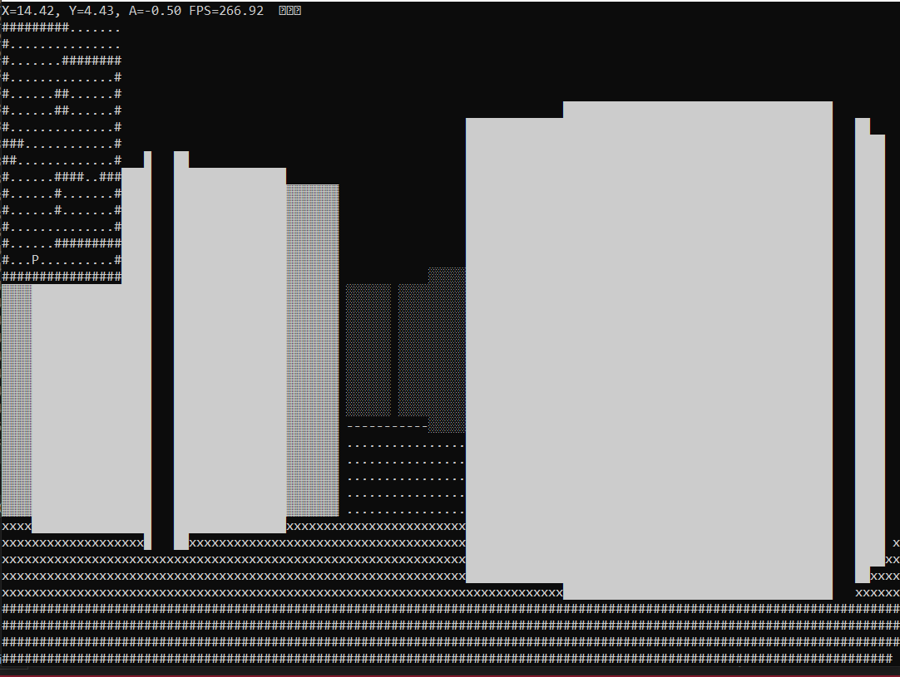

   

  <h1 align="center">3D RayCasting Tutorial With C++</h1>
    
  <h3 align="center"><a href="https://github.com/aakcay5656/3DRayCastingTutorialWithCpp">-- Tutorial --</a></h3>

### Introduction
This C++ program aims to render a game-like world view in a first-person perspective using a simple 3D ray casting technique.

### Features

- Ability to control player movement with keyboard inputs.
- Creating simple 3D images with ray casting technique.
- Screen updates in real time.

### Controls

- **W:** Forward movement
- **S:** Reverse movement
- **A:** Left turn
- **D:** Right turn

### Creating Maps

The game world uses a map on `map`, which is a wstring defined in the `main` function. The character '#' represents walls, '.' The character represents spaces.

</img> </img>

